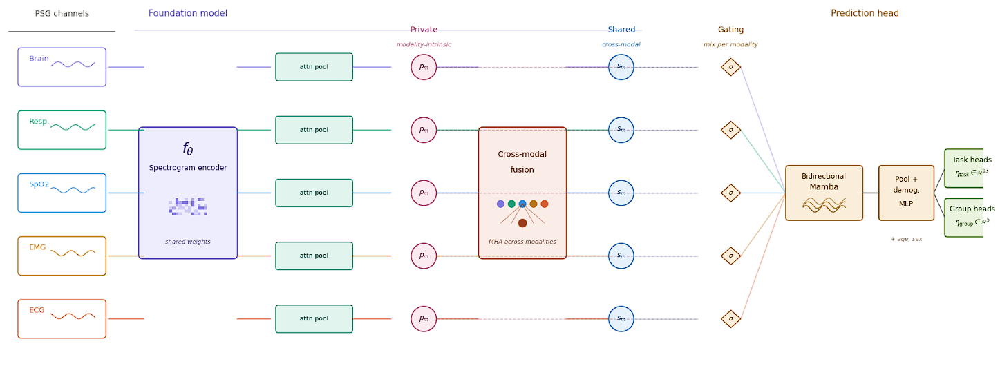

# PSG-prognostic
Thank you for visiting **PSG-prognostic**.  

This repository hosts the code and model weights from my master's thesis *"Learning Transferable Prognostic Sleep Representations from Polysomnography for Disease and Mortality Prediction"*.  

Feel free to use and build upon this work — I hope it proves useful for your projects.

This model uses a spectrogram based residual encoder:

